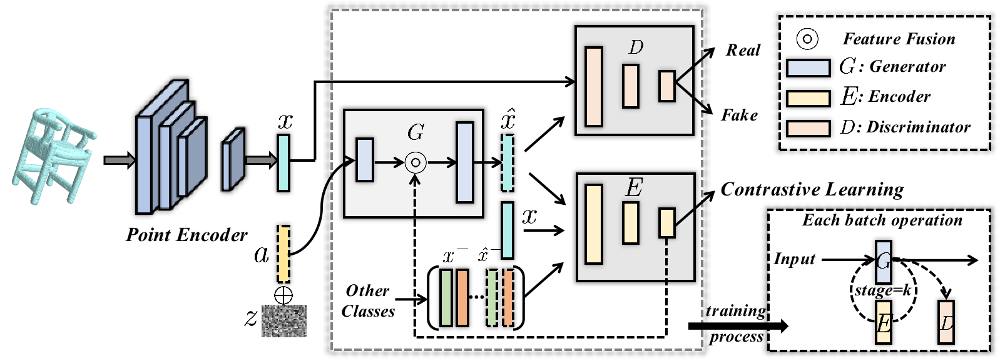
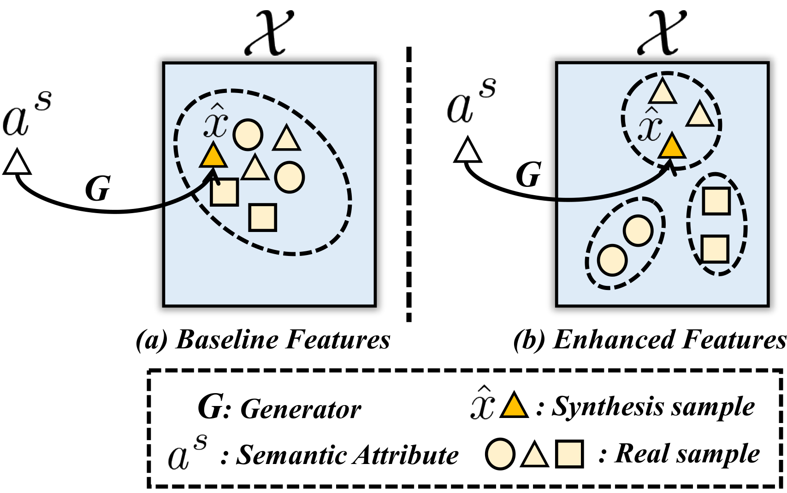
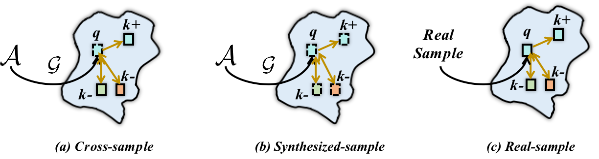
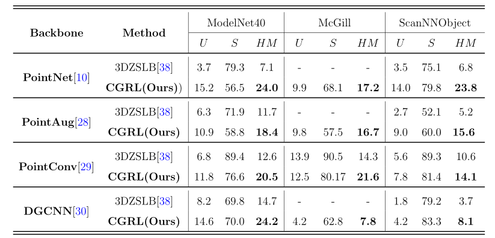
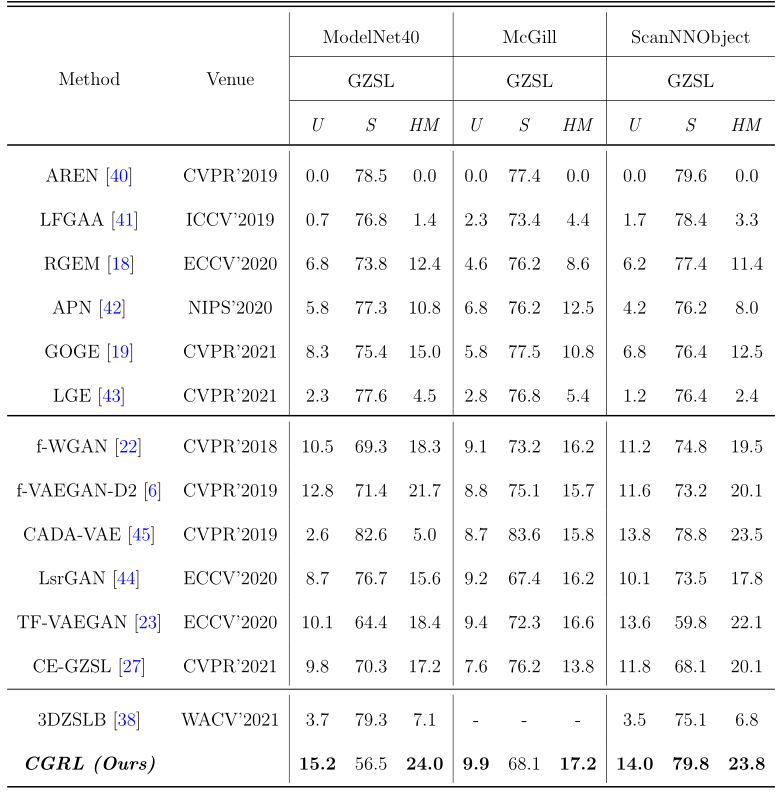

# Contrastive Generative Network with Recursive-Loop for 3D Point Cloud Generalized Zero-Shot Classification
We propose a Contrastive Generative Network with RecursiveLoop, termed as CGRL, which can be leveraged to enlarge the inter-class distances and narrow the intra-class gaps. By applying the contrastive representations to the generative model in a recursive-loop form, it can provide the self-guidance for the generator recurrently, which can help yield more discriminative features and train the better classifier. To validate the effectiveness of the proposed method, extensive experiments are conducted on three benchmarks, including ModelNet40, McGill, and ScanObjectNN. Experimental evaluations demonstrate the superiority of our approach and it can outperform the state-of-the-arts by a large margin.

## **Overall Architecture:** 

<p align="center">
  
  <br/>
  <br/>
  <b> Overall Framework for Contrastive Generative Network with Recursive-Loop (CGRL) </b>
</p>

<table>
  <tr>
    <td>  </td>
    <td>  </td>
  </tr>
  <tr >
    <td><p align="center"> <b>  Illustrative diagram of Our motivation. In our method, we aim to constrain the embedding features and result in the enhanced discriminative synthesized features.</b></p></td>
    <td><p align="center"><b> Different positive and negative pairs in the contrastive learning recursive-loop module.Different colors indicate different classes.</b></p></td>
  </tr>
</table>

## Requirment
```
Python 3.6
Pytorch 0.3.1
torchvision 0.2.0
h5py 2.10
scikit-learn 0.22.1
scipy=1.4.1
numpy 1.18.1
numpy-base 1.18.1
pillow 5.1.0
```

## Installation

For installing, follow these intructions
```
conda create -n cgrl python=3.6
conda activate cgrl
pip install https://download.pytorch.org/whl/cu90/torch-0.3.1-cp36-cp36m-linux_x86_64.whl
pip install torchvision==0.2.0 scikit-learn==0.22.1 scipy==1.4.1 h5py==2.10 numpy==1.18.1
```

## Data preparation

You can download the feature vectors, which are extracted from PointNet, PointAugment, DGCNN, and PointConv architecures, of ModelNet, McGill, and ScanObjectNN datasets from the following link

```
link: https://drive.google.com/drive/folders/1y8HbxfBWzIzZ4pH-L1wi07pfuhGy8R2m
```
Extract them in the `datasets` folder.


## Training

### Zero-Shot 3D Point Cloud Classification
1. To train and evaluate ZSL and GZSL models, please run:
```
python scripts/run_CGRL.py
```

## Results

<table>
  <tr>
    <td>  </td>
  </tr>
</table>
<table>
  <tr>
    <td>  </td>
  </tr>
</table>

## Citation:

If you find this useful, please cite our work as follows:
```
@article{hao4211583contrastive,
  title={Contrastive Generative Network with Recursive-Loop for 3d Point},
  author={Hao, Yun and Su, Yukun and Lin, Guosheng and Wu, Qingyao},
  journal={Available at SSRN 4211583}
}
```
